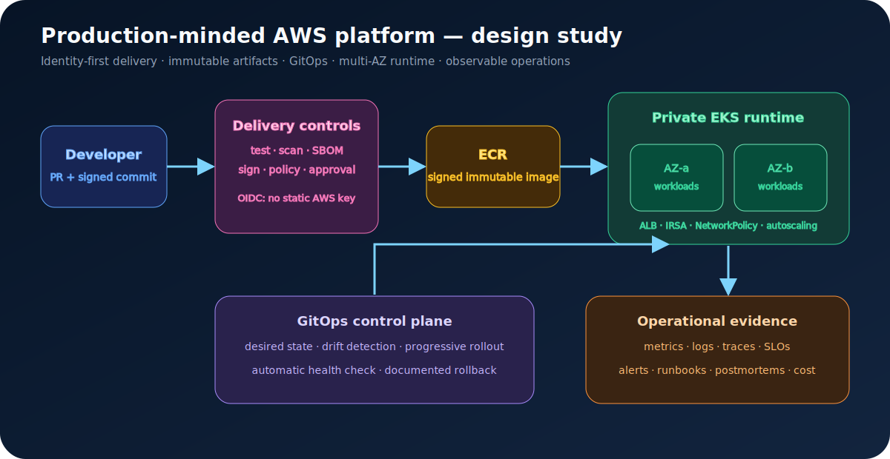

# Production-Minded AWS Platform: Design Review

> **Status: architecture study — not presented as a deployed production system.** This document demonstrates design reasoning, trade-offs, failure analysis, and an implementation/verification plan.



## Scenario and measurable goals

A small product team needs a repeatable AWS platform for a stateless HTTP service. The design optimizes for safe change and learning, not maximum service count.

| Goal | Proposed indicator |
|---|---|
| Availability | 99.9% monthly SLO for successful requests |
| Delivery | immutable artifact promoted through environments |
| Recovery | rollback decision within 10 minutes; tested restore procedure |
| Security | no long-lived AWS key in CI; workload-scoped identity |
| Operability | metrics, structured logs, traces, alerts, and runbooks |
| Cost | tagged resources, budgets, right-sizing review, non-prod schedule |

## Key decisions

### ADR-001: EKS versus a simpler container service

**Decision for the study:** EKS, to demonstrate Kubernetes operations and GitOps. **Production caveat:** for one small service, ECS/Fargate may reduce operational burden and cost. Kubernetes is justified only when its scheduling, ecosystem, portability, or multi-team platform value exceeds its complexity.

### ADR-002: GitHub OIDC instead of static AWS credentials

CI exchanges its GitHub identity for a short-lived AWS role session. Trust policy conditions should restrict repository, branch/environment, audience, and permitted role. No AWS access key is stored in GitHub.

### ADR-003: build once, deploy by digest

The pipeline tests, scans, creates an SBOM, and signs one image. Environments reference the immutable digest; tags are only human-friendly pointers.

```text
commit -> tests -> image sha256:abc -> scan/SBOM -> sign
                                      |
                                      +-> dev -> staging -> production
```

### ADR-004: GitOps for deployment state

The delivery pipeline updates desired state. A controller reconciles it and exposes drift. Progressive rollout health checks determine promotion or rollback.

## Network and identity boundaries

- Public ALB terminates TLS; worker nodes and workloads remain in private subnets across availability zones.
- Security groups allow only required flows; Kubernetes NetworkPolicy limits east-west traffic.
- IRSA/workload identity gives each workload a narrow AWS role.
- Secrets come from a managed secret store and are never committed to Git.
- Control-plane, audit, load-balancer, and application logs use defined retention.

## Delivery gates

```yaml
pull_request:
  - format_and_lint
  - unit_and_integration_tests
  - terraform_validate_and_plan
  - dependency_and_secret_scan
merge:
  - build_image_once
  - generate_sbom
  - vulnerability_policy
  - sign_artifact_and_provenance
promotion:
  - verify_signature
  - apply_desired_state
  - readiness_and_smoke_test
  - observe_error_rate_and_latency
  - promote_or_rollback
```

## Failure-mode review

| Failure | Detection | Design response | Proof exercise |
|---|---|---|---|
| One AZ unavailable | target/pod health, synthetic check | replicas spread across AZs | drain/failure simulation |
| Bad application release | error/latency burn alert | progressive rollout and digest rollback | inject failing version |
| Node capacity exhausted | pending pods and saturation | requests/limits plus autoscaling | controlled load test |
| Dependency latency | trace spans and timeout metrics | bounded timeout, retry budget, circuit behavior | add latency with a fault proxy |
| Credential misuse | CloudTrail/anomaly alert | short-lived, scoped identity | attempt denied action |
| Terraform change breaks network | plan/policy review | staged apply and recovery plan | disposable-environment test |

## SLO and alert example

```text
SLI = successful non-5xx requests / valid requests
SLO = 99.9% over 30 days
Error budget = 0.1%
```

Use multi-window burn-rate alerts rather than paging on every isolated error. A page should name the affected service/SLO, show impact, link a dashboard and runbook, and suggest the first safe checks.

## Cost and complexity review

EKS has fixed and operational costs beyond worker compute. Before implementation, compare EKS with ECS/Fargate using expected traffic, team skill, availability needs, managed-service cost, on-call burden, and opportunity cost. A credible architecture explains why a simpler option was rejected.

## Evidence required before calling it implemented

- Terraform modules and reviewed plans;
- CI runs with test, scan, SBOM, signing, and OIDC evidence;
- deployed digest and GitOps reconciliation history;
- dashboards, SLO definition, alert tests, and runbooks;
- failure injection, rollback timing, restore test, and postmortem;
- cost estimate versus actual tagged spend;
- threat model and denied-permission tests.

## Interview discussion prompts

1. When would ECS be a better choice than EKS?
2. What prevents a pull request from assuming the production role?
3. What signal causes an automatic rollback, and how do you prevent flapping?
4. How do you restore stateful dependencies, not only redeploy stateless pods?
5. Which part creates the largest operational burden and how would you simplify it?

