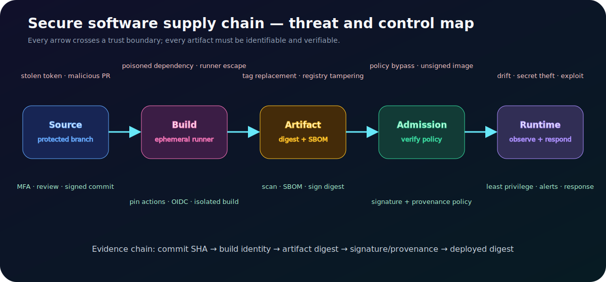

# Secure Software Supply Chain: Threat Model and Verification Plan

> **Status: security design study.** Controls below are proposed and must be demonstrated by pipeline evidence before being described as implemented.



## Security objective

The deployed workload must be traceable to reviewed source and an authorized build, and the artifact must remain identifiable and unmodified between build and runtime.

```text
reviewed commit
  -> isolated build identity
  -> immutable digest + SBOM
  -> signature + provenance
  -> admission verification
  -> runtime digest observation
```

## Threats and controls

| Boundary | Threat | Preventive control | Detective evidence |
|---|---|---|---|
| Contributor -> source | stolen account or malicious change | MFA, protected branch, required review, CODEOWNERS | audit log and signed commit status |
| Source -> runner | untrusted workflow execution | restricted events, least permissions, environment approval | workflow identity and event context |
| Dependency -> build | typosquat or compromised version | lockfile, checksum/pinning, update review | dependency diff, SBOM, scan result |
| Runner -> cloud | stolen static credential | OIDC short-lived role with conditions | cloud session principal and duration |
| Build -> registry | mutable tag or tampered upload | digest reference, immutable repository, signing | digest and signature verification |
| Registry -> cluster | untrusted image deployed | admission policy for signature/provenance | admission decision log |
| Runtime | drift or vulnerable workload | restricted identity, runtime controls, patch policy | deployed digest inventory and alert |

## Least-privilege workflow example

```yaml
permissions:
  contents: read
  id-token: write

jobs:
  build:
    environment: production-build
    steps:
      - uses: actions/checkout@PINNED_COMMIT_SHA
      - run: npm ci && npm test
      - run: docker build --pull -t "$IMAGE" .
      - run: generate-sbom "$IMAGE"
      - run: scan-with-policy "$IMAGE"
      - run: sign-by-digest "$IMAGE_DIGEST"
```

Pin third-party actions by full commit SHA and document the update process. A tag such as `@v4` is convenient but mutable.

## Policy examples

Reject deployment when:

- the image is referenced only by a mutable tag;
- the signature is absent or from an untrusted identity;
- provenance does not match the expected repository/workflow;
- a prohibited critical vulnerability exceeds the documented exception policy;
- the workload requests privileged mode, host mounts, or unrestricted capabilities;
- required resource limits or a non-root security context are absent.

## Vulnerability handling without security theatre

A scanner finding is input, not a complete risk decision. Record reachability, exploitability, runtime exposure, compensating controls, fix availability, owner, expiry, and verification. Never silently ignore or permanently blanket-suppress findings.

```text
finding -> validate package/version -> assess reachable path
        -> fix/mitigate/temporary exception -> retest -> close with evidence
```

## Verification plan

1. Modify an artifact after signing; admission must reject it.
2. Build from an unauthorized branch; cloud role assumption must fail.
3. Attempt a prohibited cloud action; IAM must deny and log it.
4. Deploy by tag instead of digest; policy must reject it.
5. Introduce a known test vulnerability; scanning must fail at the intended threshold.
6. Compare source commit, provenance, registry digest, and runtime digest.

## Incident response

If a build credential or dependency is compromised:

```text
pause promotion -> identify affected commits/builds/digests
-> revoke trust/credential -> quarantine artifacts
-> rebuild from trusted source on clean runners
-> verify signatures and runtime inventory
-> rotate exposed secrets -> document scope and lessons
```

## Recruiter-grade evidence checklist

- threat model with trust boundaries;
- workflow permissions and OIDC trust policy;
- SBOM, scan report, signature, and provenance;
- admission policy plus successful and rejected test logs;
- deployed digest inventory;
- time-bounded exception record;
- compromise response runbook and exercise notes.

The impact is not the number of security tools. It is a verifiable chain showing why the running artifact should be trusted.

